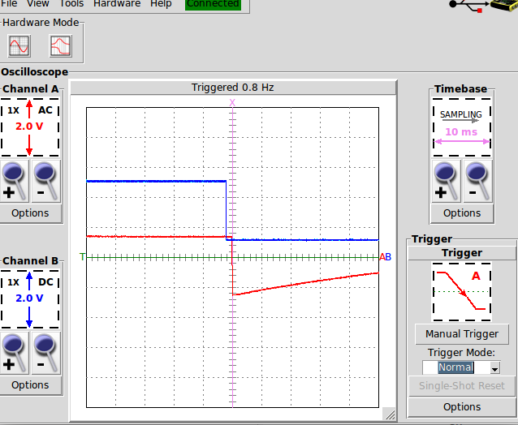
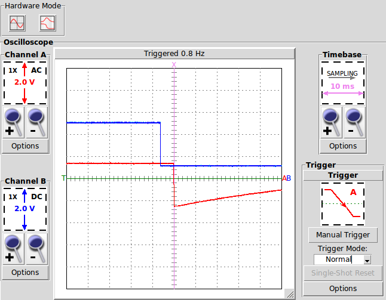

# ESPNOW_SYNC

This repository includes a library and an example of code to synchronize multiple ESP32 
devices using the [ESPNOW](https://www.espressif.com/en/products/software/esp-now/overview)
communications protocol. It is intended for use with the PlatformIO using the esp-idf backend.

Currently tested on Sparkfun ESP32 Thing boards.

A video demo of this library is [here](https://youtu.be/j6uvJLLgQaY).

## Operation

This library operates on a similar principle as 
[PTP](https://en.wikipedia.org/wiki/Precision_Time_Protocol). The elements negotiate to determine
the root and leaves of the tree, then the leaves send out packets that include their egress time.
The root sends back a packet with the original egress time, the root's ingress time. The leaf
timestamps its receipt of the return packet. With those three timestamps, the leaf adjusts its
clock to match the root.

The code is written using the task management of FreeRTOS. But it can be invoked in a way that
hides most of those details, as if it was a straight-line program. It is possible to integrate
this into another application that uses FreeRTOS, but I'm not facile enough with FreeRTOS to do that, 
or to deliver a useful library for that. Suggestions welcome.

### Known Limitations and Issues

I have only tested this with TIMER_GROUP_0 and TIMER_0. I recall seeing somewhere that this timer
was special in a way that allowed me to do a read-modify-write to update its value. But I cannot
find that statement anymore. This timer is hardcoded, currently.

Currently, the root/leaf negotiation only works for two nodes.

ESPNOW using the WiFi transceiver, and is therefore incompatible with conventional WiFi. 

## Usage

## Example

The example application espnow_sync_main.c sets up a blinking LED based on TIMER0. The synchronization of TIMER0 will result in the visible synchronization of the LEDs.

## Accuracy Measurements

Using two identical ESP32 Thing Boards, I reliably synchronize to within 3ms.

Due to limitations of my scope, the A signal is AC-coupled to generate a trigger. In DC terms,
it is a square wave.

Because of variations in the crystals, these clocks will vary and the synchronization
will decay. Below is a picture of the same synchronization after two hours.

The synchronization seems to have degrades by about 4ms, so these boards might lose 2ms per hour.

### Possible causes of Accuracy Loss

The crystals on these devices do have small PPM variations, and therefore the clocks will drift.

System interrupts can cause delays in egress of signals.

## TODOs

- [x] Add a scheme to check that the synchronization completed successfully.
- [ ] Add a negotiation scheme for more than two devices.

